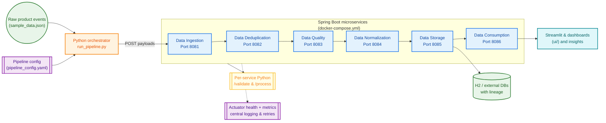

# Data Platform Architecture (Colored Diagram)

The diagram below shows how the Spring Boot microservices, Python orchestration utilities, and UI artifacts in this repository
work together to turn raw product data into consumable insights.

**Color legend**
- **Orange:** Orchestration logic driven by `run_pipeline.py` and YAML configuration.
- **Blue:** Spring Boot microservices that implement each pipeline stage with consistent REST + Python integration endpoints.
- **Green:** Data assets and persistence layers (sample payloads, H2/external databases, lineage metadata).
- **Purple:** Platform scaffolding such as Docker Compose plus observability via Actuator, logging, and retries.
- **Teal:** Consumer experiences like the Streamlit UI and analytics dashboards.
- **Yellow:** Python FastAPI adapters that each service can call for validation or processing.

Use this diagram alongside [`PROJECT_OVERVIEW.md`](PROJECT_OVERVIEW.md) and [`pipeline/README.md`](pipeline/README.md) when onboarding
new collaborators or explaining how the demo pipeline flows from raw events to analytics-ready outputs.
