# Data Platform Orchestration Pipeline

This folder stitches the Spring Boot microservices in this repository into a single, repeatable data pipeline. The Python script orchestrates the following stages:

1. **Data Ingestion Service** – stores the raw events that arrive from external systems.
2. **Data Deduplication Service** – collapses duplicate events by their original `source_record_id`.
3. **Data Quality Service** – validates the curated dataset against domain rules before downstream consumption.
4. **Data Normalization Service** – standardises cleansed data (currency, status, SKU formats) and enriches it with timestamps.
5. **Data Storage Service** – persists the normalized records and adds storage metadata for lineage and governance.
6. **Data Consumption Service** – prepares lightweight summaries so analytical consumers can discover which records are ready.

The pipeline uses the services through their REST APIs, which are exposed when the Spring Boot applications run locally (either directly with `mvn spring-boot:run` or through Docker Compose).

## Functional Walkthrough

The orchestrator reads raw purchase events from `sample_data.json`, then invokes each microservice-specific stage method in `run_pipeline.py` to transform, validate, and publish the data set end-to-end.【F:CompleteDataPipeline/data-platform-springboot-microservices/pipeline/sample_data.json†L1-L40】【F:CompleteDataPipeline/data-platform-springboot-microservices/pipeline/run_pipeline.py†L41-L173】 Each stage packages the payload that will be sent to its corresponding REST endpoint, records the microservice response, and hands the enriched dataset to the next stage.【F:CompleteDataPipeline/data-platform-springboot-microservices/pipeline/run_pipeline.py†L74-L180】

- **Ingestion** assigns a new pipeline-specific `recordId`, marks the record as `INGESTED`, and posts the raw JSON payload to the ingestion service.【F:CompleteDataPipeline/data-platform-springboot-microservices/pipeline/run_pipeline.py†L86-L108】
- **Deduplication** collapses multiple entries that share the same `source_record_id` before calling the deduplication service, adding a timestamp to indicate when the duplicate was resolved.【F:CompleteDataPipeline/data-platform-springboot-microservices/pipeline/run_pipeline.py†L110-L140】
- **Quality** enforces simple business rules—positive purchase amounts and syntactically valid emails—to decide whether the record is `VALID` or `INVALID` ahead of normalization.【F:CompleteDataPipeline/data-platform-springboot-microservices/pipeline/run_pipeline.py†L142-L170】【F:CompleteDataPipeline/data-platform-springboot-microservices/pipeline/run_pipeline.py†L228-L262】
- **Normalization** standardises currencies, status values, and SKU formatting for valid records, while flagging rejected entries with explanatory notes.【F:CompleteDataPipeline/data-platform-springboot-microservices/pipeline/run_pipeline.py†L172-L210】【F:CompleteDataPipeline/data-platform-springboot-microservices/pipeline/run_pipeline.py†L212-L225】
- **Storage** attaches lineage metadata (storage time and location) and sets whether the record was persisted or skipped so downstream teams can trace the decision.【F:CompleteDataPipeline/data-platform-springboot-microservices/pipeline/run_pipeline.py†L227-L258】
- **Consumption** distils normalized data into an analytics-ready summary, indicating availability and providing high-level purchase totals for self-service dashboards.【F:CompleteDataPipeline/data-platform-springboot-microservices/pipeline/run_pipeline.py†L260-L300】

Resilience is driven by the configuration file, which supplies base URLs, endpoints, and HTTP retry behaviour for each microservice stage.【F:CompleteDataPipeline/data-platform-springboot-microservices/pipeline/pipeline_config.yaml†L1-L16】【F:CompleteDataPipeline/data-platform-springboot-microservices/pipeline/run_pipeline.py†L52-L71】【F:CompleteDataPipeline/data-platform-springboot-microservices/pipeline/run_pipeline.py†L302-L375】 When run with the `--simulate` flag, the orchestrator logs the payloads without issuing HTTP calls—useful for validating the pipeline structure before the services are up.【F:CompleteDataPipeline/data-platform-springboot-microservices/pipeline/run_pipeline.py†L301-L320】

### Architecture Diagram

```mermaid
flowchart LR
    subgraph Sources
        SampleData[Sample data<br/>sample_data.json]
    end

    subgraph PythonOrchestrator[Python Orchestrator<br/>run_pipeline.py]
        direction LR
        Ingest[Ingestion Stage\nrecord enrichment]
        Dedup[Deduplication Stage\nremove duplicates]
        Quality[Quality Stage\napply business rules]
        Normalize[Normalization Stage\nstandardise payload]
        Storage[Storage Stage\nappend lineage metadata]
        Consumption[Consumption Stage\nsummarise availability]
    end

    subgraph SpringBootServices[Spring Boot Microservices]
        direction LR
        SvcIngest[DataIngestion API]
        SvcDedup[DataDeduplication API]
        SvcQuality[DataQuality API]
        SvcNormalize[DataNormalization API]
        SvcStorage[DataStorage API]
        SvcConsumption[DataConsumption API]
    end

    SampleData --> Ingest
    Ingest -->|POST /api/v1/dataingestion| SvcIngest
    SvcIngest --> Dedup
    Dedup -->|POST /api/v1/datadeduplication| SvcDedup
    SvcDedup --> Quality
    Quality -->|POST /api/v1/dataquality| SvcQuality
    SvcQuality --> Normalize
    Normalize -->|POST /api/v1/datanormalization| SvcNormalize
    SvcNormalize --> Storage
    Storage -->|POST /api/v1/datastorage| SvcStorage
    SvcStorage --> Consumption
    Consumption -->|POST /api/v1/dataconsumption| SvcConsumption

    SvcConsumption --> Outputs[Downstream Consumers<br/>dashboards & ML]
```



## Repository Layout

```
pipeline/
├── README.md                # This document
├── pipeline_config.yaml     # Base URLs and HTTP settings for each service stage
├── run_pipeline.py          # Python orchestrator for all microservices
└── sample_data.json         # Example payload with duplicates and quality issues
```

## Quick Start

1. **Start the microservices** (in separate terminals):
   ```bash
   cd CompleteDataPipeline/data-platform-springboot-microservices
   docker-compose up --build
   ```
   or run each Spring Boot application with `mvn spring-boot:run`.

2. **Install the orchestration dependencies** (only required once):
   ```bash
   pip install requests pyyaml
   ```

3. **Execute the pipeline**:
   ```bash
   python pipeline/run_pipeline.py --log-level INFO
   ```
   The script will POST records to each service in sequence. Use the `--simulate` flag to dry-run the pipeline without making HTTP requests (useful when the services are not running).

   ```bash
   python pipeline/run_pipeline.py --simulate --log-level DEBUG
   ```

## How It Works

- **Configuration Driven:** `pipeline_config.yaml` describes where each microservice runs. Update the URLs if you expose the services on different hosts or ports.
- **Stage Summaries:** Each stage collects the payload sent to the service and the returned response, which makes it easy to debug the pipeline or feed the results into monitoring dashboards.
- **Embedded Data Rules:** The orchestrator applies basic business rules in the quality stage (positive purchase amounts and valid email formats) and enriches successful records with normalization, storage, and consumption metadata.
- **Sample Dataset:** `sample_data.json` includes duplicates and a purposely invalid record so that the deduplication and quality stages produce meaningful output.

## Extending the Pipeline

- Add new services by editing `pipeline_config.yaml` and creating another `_run_<stage>` method in `run_pipeline.py`. The current implementation demonstrates chaining ingestion, deduplication, quality, normalization, storage, and consumption services.
- Replace the inline validation logic with calls to the microservices' `/process` or `/validate` endpoints if you implement additional Python-based workflows.
- Persist or broadcast the stage results by serialising `StageResult` objects to disk, publishing them to Kafka, or triggering downstream analytics jobs.

## Troubleshooting

| Symptom | Possible Cause | Suggested Fix |
|--------|----------------|---------------|
| `PipelineError` about configuration | Missing or misnamed service key | Check `pipeline_config.yaml` for typos |
| Connection refused errors | Services are not running | Start the Spring Boot apps or run in `--simulate` mode |
| Non-200 HTTP responses | Validation failure in a service | Inspect the `response` payload printed at the end of the run |

Happy pipelining! 🚀
