# Data Platform Orchestration Pipeline

A lightweight Python wrapper that drives the Spring Boot microservices in this repository as a single, repeatable data pipeline.

## Pipeline at a Glance

```mermaid
flowchart LR
    Raw[Raw events\nsample_data.json]
    subgraph Orchestrator[Python orchestrator\nrun_pipeline.py]
        direction LR
        Ingest[Ingest\nassign recordId]
        Dedup[Deduplicate\nremove repeats]
        Quality[Quality\nvalidate rules]
        Normalize[Normalize\nstandardise fields]
        Store[Store\nappend lineage]
        Consume[Consume\nsummarise data]
    end
    subgraph Services[Spring Boot microservices]
        direction LR
        SvcIngest[/Data Ingestion/]
        SvcDedup[/Data Deduplication/]
        SvcQuality[/Data Quality/]
        SvcNormalize[/Data Normalization/]
        SvcStore[/Data Storage/]
        SvcConsume[/Data Consumption/]
    end

    Raw --> Ingest -->|POST /dataingestion| SvcIngest --> Dedup
    Dedup -->|POST /datadeduplication| SvcDedup --> Quality
    Quality -->|POST /dataquality| SvcQuality --> Normalize
    Normalize -->|POST /datanormalization| SvcNormalize --> Store
    Store -->|POST /datastorage| SvcStore --> Consume
    Consume -->|POST /dataconsumption| SvcConsume --> Insights[Dashboards & ML]
```


## What each stage does
- **Ingest:** enriches raw events and publishes them to the ingestion API.
- **Deduplicate:** removes duplicate `source_record_id` entries before forwarding the payload.
- **Quality:** applies purchase amount and email checks to tag records as valid/invalid.
- **Normalize:** harmonises currency, SKU, and status values for valid records.
- **Store:** adds storage metadata so records are traceable downstream.
- **Consume:** produces a summary view for analytics consumers.

## Repository essentials
```
pipeline/
├── README.md                # This guide
├── pipeline_config.yaml     # Base URLs + retry policy for each stage
├── run_pipeline.py          # Orchestration logic
└── sample_data.json         # Demo payload with duplicates + quality issues
```

## Run it locally
1. Start the Spring Boot services:
   ```bash
   cd CompleteDataPipeline/data-platform-springboot-microservices
   docker-compose up --build
   ```
   *(Alternatively run each app with `mvn spring-boot:run`.)*
2. Install Python dependencies once:
   ```bash
   pip install requests pyyaml
   ```
3. Execute the pipeline:
   ```bash
   python pipeline/run_pipeline.py --log-level INFO
   ```
   Use `--simulate` to dry-run without HTTP calls while verifying the stage flow.

## Configuration tips
- Update `pipeline_config.yaml` if the service hostnames or ports change.
- Retries, timeouts, and base paths are centralised in the config and loaded on startup.
- Stage results are logged so you can inspect payloads and responses step by step.

## Troubleshooting quick hits
| Symptom | Likely cause | Fix |
| --- | --- | --- |
| `PipelineError` referencing a service | Missing key in `pipeline_config.yaml` | Align the config keys with the service names |
| Connection refused | Services not running | Start the Spring Boot apps or run with `--simulate` |
| Non-200 HTTP responses | Validation failed in a microservice | Inspect the logged response for details |

Happy pipelining! 🚀
